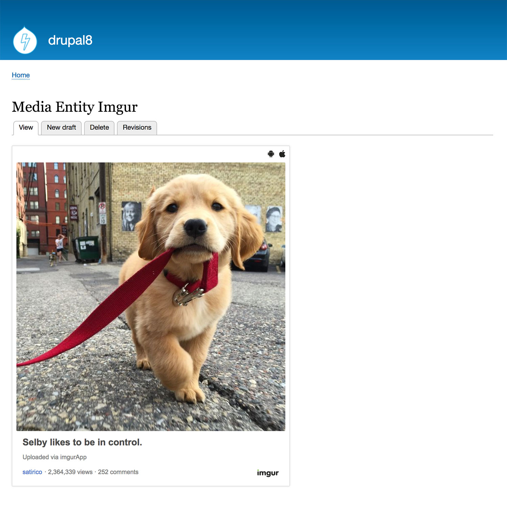

# Media Entity Imgur
This module provides Imgur integration (i.e. media type
provider plugin) for [Media Entity Module](https://www.drupal.org/project/media_entity).

## Installation
1. Enable the media_entity and media_entity_imgur module.
2. Go to `/admin/structure/media` and click 'Add media bundle' to create a new bundle.
3. Under **Type provider** select Imgur.
4. Save the bundle.
5. Add a field to the bundle to store the imgur source. (this should be a plain text field).
6. Edit the bundle again, and select the field created above as the **Imgur source field**.

## Project Code
* GitHub
[lightning_media_imgur](https://github.com/dakkusingh/lightning_media_imgur) | [media_entity_imgur](https://github.com/dakkusingh/media_entity_imgur)

* Drupal.org
[lightning_media_imgur](https://www.drupal.org/project/lightning_media_imgur) | [media_entity_imgur](https://www.drupal.org/project/media_entity_imgur)
